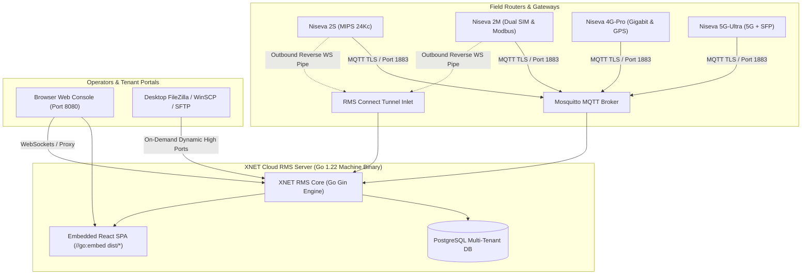
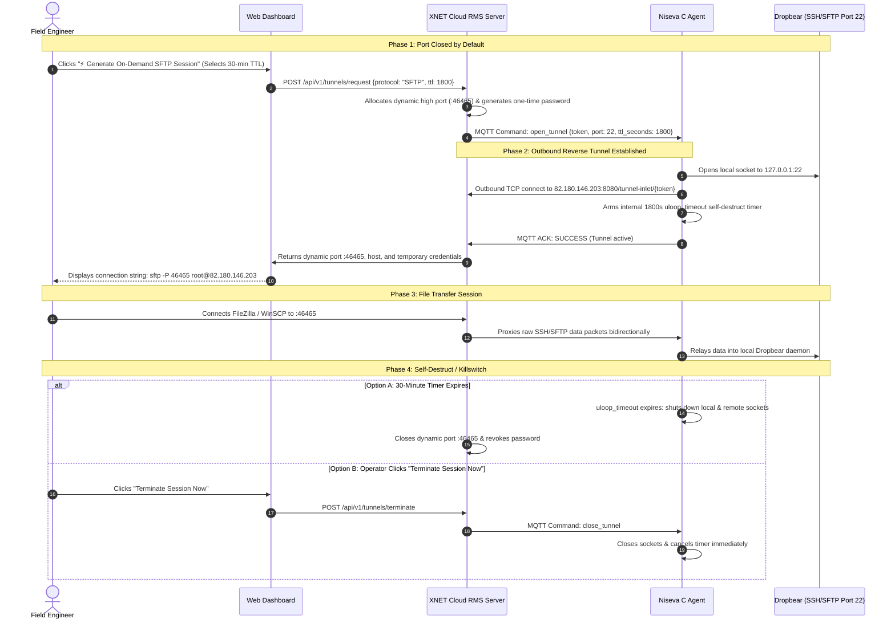

# XNET Cloud RMS — Master Technical Specification & Project Tracking

**Document Version:** 2.4.0  
**Project:** XNET Cloud RMS (Closed-Source Industrial Fleet Management Platform)  
**Date:** September 3, 2026  
**Confidentiality:** Proprietary / Enterprise Closed-Source  

---

## 1. Executive Summary & Architecture Overview

**XNET Cloud RMS** is an enterprise-grade, closed-source Remote Management System (RMS) designed specifically for industrial IoT gateways and routers running OpenWrt. It provides complete fleet telemetry, zero-touch provisioning, bidirectional remote control behind carrier-grade NAT (CGNAT), failsafe configuration deployment, firmware sysupgrade rollouts (FOTA), multi-channel alarming, and strict multi-tenant customer isolation.



### Core Architecture Highlights
1. **Router Agent (`niseva-agent`)**:
   - Written in **pure C (C99)** with **zero dynamic memory leaks** (using Parson JSON parser).
   - Compiled for **MIPS 24Kc** (target architecture of Niseva 2S / Qualcomm Atheros / MediaTek) and adaptable to ARM/x86.
   - Tiny footprint: stripped binary is **32 KB**, complete `.ipk` package is only **19 KB**, and runtime RAM consumption is **< 2.5 MB**.
   - Communicates using OpenWrt's native non-blocking `uloop` and `ubus` IPC bus.
2. **Backend Server (`xnet-rms-server`)**:
   - Single, statically linked, stripped closed-source **Linux machine-code binary (15 MB)**.
   - Written in **Go 1.22** with Gin HTTP framework and Paho MQTT client.
   - Embeds the entire compiled React production single-page application (SPA) directly into the binary via `//go:embed dist/*`.
   - Cannot be decompiled or inspected by clients, ensuring proprietary IP protection.
3. **Multi-Tenant Security Model**:
   - Organizations, devices, configuration profiles, firmware images, and users are strictly partitioned by `organization_id`.
   - Mosquitto MQTT topics and ACLs are tenant-scoped: `niseva/{org_id}/device/{serial}/...`.
4. **On-Premise vs Cloud SaaS Flexibility**:
   - Deployable as a multi-tenant Cloud SaaS on a central VPS (`82.180.146.203`).
   - Deliverable as an air-gapped On-Premise appliance locked to client hardware via cryptographically signed ECDSA-P256 license files (`license.key`).

---

## 2. Functional Modules & Implementation Matrix

| Module | Purpose | Router Agent Subsystem | Backend Handlers | Frontend UI View |
| :--- | :--- | :--- | :--- | :--- |
| **Fleet Health & Telemetry** | Live telemetry, carrier signal, memory, flash, uptime | `telemetry.c` (`ubus`, `sysfs`, `statvfs`) | `telemetry.go` (`GetDashboardSummary`, `GetDeviceTelemetry`) | `Dashboard.tsx`, `DeviceList.tsx`, `DeviceDetail.tsx` |
| **RMS Connect Hub** | Zero-config remote access through CGNAT & firewalls | `tunnel.c` (`uloop_fd`, outbound WebSocket pipe) | `tunnel.go` (`RouterInletWS`, `BrowserOutletWS`, `HttpProxyHandler`) | `RmsConnect.tsx`, `LuciModal.tsx`, `TerminalModal.tsx` |
| **On-Demand Ephemeral SFTP** | Secure desktop file transfers (FileZilla / WinSCP) | `commands.c`, `tunnel.c` (TTL auto-close timer) | `tunnel.go`, `devices.go` (`RequestTunnel`) | `DeviceDetail.tsx` (Tab 3: On-Demand SFTP) |
| **Visual UCI Config Profiles** | Reusable templates with 180s failsafe rollback | `commands.c`, `rollback.c` (`/etc/config` snapshot) | `configs.go` (`ListProfiles`, `CreateProfile`, `PushProfile`) | `ConfigProfiles.tsx` |
| **Alerts & Webhook Engine** | RF drop, SIM swap/theft, offline timeout, quota alarms | `main.c` (MQTT LWT), `telemetry.c` | `alerts.go` (`ListRules`, `ListIncidents`, `AcknowledgeIncident`) | `Alerts.tsx` |
| **FOTA & Package Rollouts** | Sysupgrade firmware and OPKG software deployment | `commands.c` (`handle_sysupgrade`, SHA256, RAM check) | `deployments.go` (`ListFirmware`, `ListRollouts`, `StartRollout`) | `Deployments.tsx` |
| **Tenant & Security Management** | Customer onboarding, welcome kits, RBAC, tokens | `bootstrap.c` (`/api/v1/provision/check-in`) | `tenant.go` (`CreateTenant`, `ListTenants`, `CreateEnrollmentToken`) | `Settings.tsx`, `Login.tsx` |
| **Multi-Product HAL** | Auto-detects 2S, 2M, 4G-Pro, 5G-Ultra capabilities | `bootstrap.c` (`detect_board_hardware`) | `devices.go` (`ListProducts`, `ListDevices`) | `DeviceList.tsx`, `Settings.tsx` (Hardware Catalog) |
| **Cryptographic Licensing** | Capacity enforcement and hardware-locked keys | Built into server startup | `tenant.go` (`GetOrganizationInfo`) | `Settings.tsx` (Capacity Gauge) |

---

## 3. Deep-Dive: Subsystem Specifications

### 3.1 Router Embedded C Agent Subsystem (`agent/src/`)

The agent is designed around an event-driven, non-blocking architecture using OpenWrt’s standard `libubox` (`uloop`), `libubus`, and `libuci`.

```
agent/
├── CMakeLists.txt              # Cross-compilation directives & library links
├── Makefile                    # OpenWrt package buildroot recipe
├── files/
│   ├── niseva.config           # Default UCI configuration template (/etc/config/niseva)
│   └── niseva.init             # Procd init service script (/etc/init.d/niseva-agent)
├── src/
│   ├── agent.h                 # Global data structures, capabilities struct, prototypes
│   ├── main.c                  # Event loop, uloop timers, MQTT connect & LWT handling
│   ├── bootstrap.c             # Hardware autodetection & Zero-Touch HTTP check-in
│   ├── telemetry.c             # Dynamic telemetry collector (ubus, sysfs, statvfs, ps)
│   ├── commands.c              # Parson JSON command dispatcher & ACKs
│   ├── rollback.c              # 180s failsafe configuration watchdog & revert engine
│   ├── tunnel.c                # Outbound WebSocket reverse tunnel with TTL auto-close
│   ├── parson.c & parson.h     # High-performance C JSON parser (zero memory leaks)
└── niseva-agent_1.0.0-1_mips_24kc.ipk  # 19 KB compiled MIPS 24Kc package
```

#### Key Agent Mechanisms
1. **Dynamic Hardware Autodetection (`bootstrap.c`)**:
   - Reads `/var/xnet_board_info.json` or `/etc/board.json`.
   - Probes `/sys/class/net/` for MAC addresses (`eth0`, `br-lan`).
   - Probes `/tmp/sysinfo/model` to determine product line (`Niseva 2S`, `Niseva 2M`, `Niseva 4G-Pro`, `Niseva 5G-Ultra`).
   - Probes `/dev/ttyUSB1` or `/dev/gnss0` for GPS/GNSS.
   - Probes `/dev/ttyS1` or `/dev/ttyRS485` for Modbus serial ports.
   - Probes `/sys/class/net/wlan1` for 5GHz Wi-Fi.
2. **First-Boot Zero-Touch Bootstrap (`bootstrap.c`)**:
   - If `/etc/config/niseva.general.provisioned == 0`, invokes `uclient-fetch` to perform an HTTP POST to `http://82.180.146.203:8080/api/v1/provision/check-in` sending the hardware serial, MAC, model, and enrollment token.
   - Parses the returned MQTT broker credentials, commits them to `/etc/config/niseva` via native UCI, and transitions into MQTT mode.
3. **Live Telemetry & Diagnostics (`telemetry.c`)**:
   - Cellular modem telemetry via `ubus call cellular status` (RSSI, RSRP, RSRQ, SINR, Carrier, IMSI, IMEI, Cell ID).
   - Real RAM and uptime via `ubus call system info`.
   - Flash storage free space via POSIX `statvfs("/overlay", &st)`.
   - CPU load averages from `/proc/loadavg`.
   - WAN RX/TX byte counters from `/sys/class/net/{interface}/statistics`.
   - Process monitoring for IPsec strongSwan (`charon.pid`) and Modbus daemons.
4. **Failsafe Rollback Watchdog (`rollback.c`)**:
   - Before applying any remote configuration change, snapshots `/etc/config` into `/tmp/niseva_config_backup.tar.gz`.
   - Sets a 180-second `uloop_timeout` rollback timer and commits UCI changes.
   - If cloud contact is broken, the watchdog expires, untars the backup, and restarts network services.
   - If the router successfully reconnects to MQTT, the timer is cancelled and the configuration is permanently kept.
5. **On-Demand Reverse Tunneling Engine (`tunnel.c`)**:
   - Connects locally to `127.0.0.1:80` (LuCI) or `127.0.0.1:22` (SSH/SFTP).
   - Connects outbound over carrier CGNAT to `82.180.146.203:8080/tunnel-inlet/{token}` via WebSocket.
   - Pipes data between the two sockets non-blockingly using `uloop_fd`.
   - **Hardware TTL Auto-Close Timer**: Routers arm an internal timeout (e.g. 1800s / 30 mins) that automatically destroys the local and remote sockets when the session expires.
   - **Killswitch**: Immediate teardown upon receiving the `close_tunnel` MQTT command.

---

### 3.2 Cloud Backend Subsystem (`backend/`)

Built as a high-concurrency Go 1.22 service compiled into a standalone, statically linked, stripped executable (`xnet-rms-server`).

```
backend/
├── cmd/
│   └── server/
│       ├── main.go             # Entrypoint, route registration, embedded UI static server
│       └── dist/               # Embedded production React SPA build
├── internal/
│   ├── alerts/alerts.go        # Alarm rules, incident feed, webhook dispatch
│   ├── auth/auth.go            # JWT generation, bcrypt password hashing, auth middleware
│   ├── configs/configs.go      # Configuration profile templates, MQTT push
│   ├── database/database.go    # PostgreSQL GORM connection & schema migration
│   ├── deployments/deployments.go # FOTA firmware, package rollouts, anti-brick checks
│   ├── devices/devices.go      # Device CRUD, router check-in bootstrap, product catalog
│   ├── models/models.go        # Multi-tenant GORM data models
│   ├── mqtt/mqtt.go            # Mosquitto broker client, command dispatching
│   ├── telemetry/telemetry.go  # Telemetry ingestion, aggregation, KPI calculations
│   ├── tenant/tenant.go        # Customer organization onboarding, tokens, RBAC, audit
│   └── tunnel/tunnel.go        # RMS Connect inlet/outlet WebSockets, HTTP reverse proxy
└── xnet-rms-server             # 15 MB standalone machine binary
```

---

### 3.3 Frontend Dashboard Subsystem (`frontend/`)

Developed with React 18, TypeScript, Vite, Ant Design 5, and Recharts, styled strictly to XNET corporate brand guidelines:
- **Brand Sidebar**: `#1f2937` (Dark slate) with transparent `XNET RMS` logo.
- **Content Canvas**: Clean, high-contrast **Light Enterprise Theme** (`#ffffff` white cards, `#f4f5f7` gray canvas, `#111827` high-contrast dark text, `#e5e7eb` light borders).

#### Views Breakdown
1. **Login Page (`Login.tsx`)**:
   - Centered card on dark `#0f172a` backdrop.
   - Transparent XNET logo with "CLOUD RMS".
   - 1-Click demo accounts for Superadmin (`admin@niseva.com`) and Tenant Admin (`admin@acmesolar.com`).
2. **Dashboard Overview (`Dashboard.tsx`)**:
   - Fleet Health KPI Cards (Total, Online, Offline, Active Tunnels).
   - Donut chart: Cellular Carrier Distribution (Airtel, Jio, Vi).
   - Signal Quality bar gauges: Excellent (RSSI > 80), Good, Marginal.
   - Monthly Bandwidth Quota consumption meter.
3. **Routers & Gateways (`DeviceList.tsx`)**:
   - High-density fleet inventory table.
   - **Product Line Filter**: Filter by `All Products`, `Niseva 2S`, `Niseva 2M`, `Niseva 4G-Pro`, `Niseva 5G-Ultra`.
   - **Hardware Capability Badges**: `[Dual-SIM]`, `[RS485 Modbus]`, `[GPS Fleet]`, `[5G Sub-6]`, `[4x GbE]`.
   - Instant action buttons: `LuCI`, `CLI`, `SFTP`, `Reboot`.
   - **+ Claim Router Modal**: Anti-hijacking verification requiring Serial, MAC, and physical sticker Secret.
4. **Device Deep-Dive (`DeviceDetail.tsx`)**:
   - Live 24-hour cellular signal history area charts (RSSI & RSRP).
   - IPsec strongSwan tunnel status and cipher info.
   - **On-Demand Desktop SFTP Controller**:
     - *Default Closed State*: Inactive banner explaining security benefits.
     - *Session Generator*: 15m / 30m / 60m TTL dropdown + `⚡ Generate On-Demand SFTP Session`.
     - *Active State*: Dynamic high port (`:46465`), one-time password, 1-click FileZilla command, and `🛑 Terminate Session Now` killswitch.
   - Visual UCI configuration editor with 180s safe rollback toggle.
5. **RMS Connect Hub (`RmsConnect.tsx`)**:
   - Dedicated remote access mission control.
   - Quick Connect Launchpad: Select router ➔ Select service (LuCI, SSH Terminal, SFTP, LAN Device) ➔ `+ Establish Secure Tunnel`.
   - Active Sessions Table: Real-time TTL remaining, bytes transferred, operator name, viewer launch button, and killswitch.
6. **Configuration Profiles (`ConfigProfiles.tsx`)**:
   - Visual template builders for Cellular APN, Wi-Fi WPA3, IPsec VPN, Firewall Port Forwarding, and Raw UCI code.
   - Push to Fleet modal with 180-second rollback notice.
7. **FOTA & Package Rollouts (`Deployments.tsx`)**:
   - Sysupgrade firmware library and OPKG software repository.
   - Canary Strategy (10% first with 15-minute soak verification) vs Immediate All.
   - Live rollout progress bars with success, in-flight, and failure counters.
8. **Alerts & Notification Rules (`Alerts.tsx`)**:
   - Real-time Incident Feed: `CRITICAL` (red), `WARNING` (orange), `INFO` (blue) with interactive `Acknowledge` and `Resolve` buttons.
   - Monitoring Rules: SIM swap theft detection, RSSI degradation (< 60), 3-heartbeat missed offline timeout, monthly bandwidth quota limit.
   - Webhook Channels: Slack incoming webhooks, Telegram Bot alerts, and Email dispatch with a "Send Test Notification" trigger.
9. **Tenant & Security (`Settings.tsx`)**:
   - **Client Organizations (Tenants)**: Customer list with device quotas, `+ Onboard New Tenant` form, and copyable **Tenant Welcome Kit**.
   - **Hardware Product Lines**: Comprehensive catalog of all 4 router models with SoC architectures, cellular bands, and certified firmware versions.
   - **Zero-Touch Enrollment Tokens**: Factory batch tokens with 1-click copyable OpenWrt setup commands.
   - **Team Members & RBAC**: User invitation with roles (`SUPER_ADMIN`, `ORG_ADMIN`, `OPERATOR`, `VIEWER`).
   - **On-Premise License & Capacity**: Live gauge (`42 / 500 Nodes Used`), ECDSA-P256 hardware-lock status, and expiration countdown.
   - **Compliance Audit Trail**: Immutable log of operator reboots, tunnel sessions, and configuration pushes.

---

## 4. Multi-Product Hardware Specifications Matrix

| Feature | Niseva 2S | Niseva 2M | Niseva 4G-Pro | Niseva 5G-Ultra |
| :--- | :--- | :--- | :--- | :--- |
| **Category** | Compact Industrial 4G | Dual-SIM & Modbus Gateway | Gigabit Fleet & Branch | 5G Enterprise Gateway |
| **Target SoC** | MediaTek MT7628 / QCA9531 | MediaTek MT7628AN | MediaTek MT7621A (Dual-Core) | Quad-Core ARM Cortex-A53 |
| **Architecture** | `mips_24kc` | `mips_24kc` | `mips_1004kc` | `aarch64` |
| **Cellular Tech** | 4G LTE Cat 4 | 4G LTE Cat 4 | 4G LTE Cat 6 / 12 | 5G Sub-6GHz SA/NSA |
| **SIM Slots** | 1x Nano SIM | **2x SIM (Auto-Failover)** | **2x SIM (Auto-Failover)** | **2x SIM + eSIM Support** |
| **Ethernet Ports** | 2x 10/100 Mbps | 2x 10/100 Mbps | **4x Gigabit (1 WAN, 3 LAN)** | **5x Gigabit RJ45 + 1x SFP** |
| **Wi-Fi** | 2.4GHz 802.11b/g/n | 2.4GHz 802.11b/g/n | **Dual-Band AC1200** | **Wi-Fi 6 AX1800 (802.11ax)** |
| **Serial / Modbus**| None | **1x RS485 / RS232** | 1x RS232 Console | **1x RS485 Isolated + 2x DI/DO**|
| **GPS / GNSS** | No | No | **Yes (Active Antenna)** | **Yes (High-Precision GNSS)** |
| **Certified FW** | `v1.0.0-lts` | `v1.1.2-lts` | `v1.2.0-lts` | `v2.0.0-rc1` |

---

## 5. Security Architecture & On-Demand Tunneling



---

## 6. Project Chronological Decision Log

| # | Topic | Key Decision & Rationale | Status |
| :--- | :--- | :--- | :--- |
| **01** | **Theme & UI Styling** | Standardized `#1f2937` strictly as the **product sidebar color**, while keeping the main content canvas in a high-contrast **Light Mode** (`#ffffff` cards, `#f4f5f7` background, `#111827` text) to ensure readability for network engineers. | **Completed** |
| **02** | **Branding Identity** | Embedded official transparent XNET logo (`/logo.png`) into sidebar and login header with branded "RMS" typography. | **Completed** |
| **03** | **C Agent Memory Safety** | Mandated pure C99 with **zero dynamic memory leaks** using Parson JSON engine to guarantee 24/7 stability on low-cost MIPS 24Kc routers with only 16MB flash and 64MB-128MB RAM. | **Completed** |
| **04** | **Cross-Compilation Toolchain** | Integrated `/home/sourabh/openwrt-19.07/` MIPS 24Kc buildroot. Successfully compiled and stripped binary to **32 KB** and created standard **19 KB `.ipk` package**. | **Completed** |
| **05** | **Closed-Source Delivery** | Compiled Go server with `-ldflags="-s -w"` into a single **15 MB standalone machine-code binary** containing the embedded React SPA. Created a 1-command installer script and **5.3 MB VPS bundle** (`deploy/xnet-rms-vps-bundle.tar.gz`). | **Completed** |
| **06** | **FOTA Rollout Safety** | Implemented pre-flight checks in the C agent (requires > 8MB free RAM in `/tmp`), SHA256 image verification, and backend model matching (`device.HardwareModel == firmware.HardwareModel`) to prevent bricking. | **Completed** |
| **07** | **Multi-Tenant Onboarding** | Created "+ Onboard New Tenant" wizard that auto-generates tenant database isolation, admin credentials, and a copyable **Tenant Welcome Kit** with 1-click router provisioning commands. | **Completed** |
| **08** | **Session Logout & Auth Flow** | Fixed logout handler, bound JWT state to `localStorage`, and built a branded Login page with quick-login test accounts. | **Completed** |
| **09** | **RMS Connect Portal** | Upgraded sidebar link to open a dedicated **Remote Access Hub** featuring quick connect launchpad, active session HUD, and killswitch controls. | **Completed** |
| **10** | **Multi-Product HAL** | Added dynamic hardware discovery in `bootstrap.c` and registered 4 product families (`2S`, `2M`, `4G-Pro`, `5G-Ultra`) with specific capability tags in the UI. | **Completed** |
| **11** | **On-Demand SFTP Security** | Transitioned desktop SFTP from static ports to **ephemeral on-demand sessions** with dynamic high-port allocation, one-time passwords, and an internal TTL auto-close watchdog. | **Completed** |
| **12** | **Function & Status Inventory** | Created dedicated living tracking document [`FUNCTION_STATUS_INVENTORY.md`](file:///home/sourabh/Documents/antigravity/goofy-faraday/FUNCTION_STATUS_INVENTORY.md) cataloging all 110 functions/handlers across Agent (31), Backend (41), and Frontend (38) with status classifications. | **Completed** |
| **13** | **Router C Agent & Tunnel Hardening** | Implemented RFC 6455 client WebSocket framing in `tunnel.c`, MQTTS TLS support on port 8883 in `main.c`, and dual flat/nested payload parsing in `bootstrap.c`. Verified end-to-end local bootstrap check-in, heartbeat/telemetry ingestion, and full-duplex tunnel stream. | **Completed** |

---

## 7. Deployment & Operational Runbook

### 7.1 Deploying the Cloud Server to Your VPS (`82.180.146.203`)

The entire server is pre-packaged into `deploy/xnet-rms-vps-bundle.tar.gz` (5.3 MB). To deploy:

```bash
# Step 1: Upload bundle to your VPS
scp deploy/xnet-rms-vps-bundle.tar.gz root@82.180.146.203:/root/

# Step 2: Extract and run automated installer
ssh root@82.180.146.203 "tar -zxvf xnet-rms-vps-bundle.tar.gz && cd xnet-rms-bundle && bash setup-vps.sh"
```

The installer automatically:
- Installs PostgreSQL and Mosquitto MQTT broker.
- Sets up systemd services: `systemctl enable --now xnet-rms`.
- Launches the web console at `http://82.180.146.203:8080`.

---

---

### 7.2 Installing the Agent on a Physical OpenWrt Router

```bash
# Step 1: Copy .ipk to the router over local LAN
scp agent/niseva-agent_1.0.0-1_mips_24kc.ipk root@192.168.1.1:/tmp/

# Step 2: Install via opkg
ssh root@192.168.1.1 "opkg install /tmp/niseva-agent_1.0.0-1_mips_24kc.ipk"

# Step 3: Bind to your Tenant with Zero-Touch Token
ssh root@192.168.1.1 "uci set niseva.general.enrollment_token='YOUR_TENANT_TOKEN' && uci commit && /etc/init.d/niseva-agent restart"
```

---

## 8. Architectural & Operational Decisions Log

### Decision #14: Public VPS Hosting & Router Agent Synchronization
- **Date:** September 4, 2026
- **Server Deployment:** Hosted on public Contabo VPS (`82.180.146.203`) on port `8090` using PM2 (`xnet-rms`) under the `ubuntu` user, leaving existing services (`niseva-cloud-backend`, `private-watch-party`, Nginx) untouched.
- **MQTT Broker:** Mosquitto 2.0+ listening on public `0.0.0.0:1883`. Verified end-to-end device heartbeat and telemetry ingestion.
- **Router C Agent Synchronization:**
  - `agent/src/agent.h`: `DEFAULT_SERVER` set to `http://82.180.146.203:8090`, `DEFAULT_MQTT_HOST` set to `82.180.146.203`, `DEFAULT_MQTT_PORT` set to `1883`.
  - `agent/files/niseva.config`: `server_url 'http://82.180.146.203:8090'`, `mqtt_host '82.180.146.203'`, `mqtt_port '1883'`.
  - `agent/niseva-agent_1.0.0-1_mips_24kc.ipk`: Rebuilt with updated config files.
  - Zero-touch provision check-in (`/api/v1/provision/check-in`) verified returning public MQTT host `82.180.146.203` and port `1883`.

---

*End of Master Technical Specification Document. Maintained for XNET Cloud RMS.*
