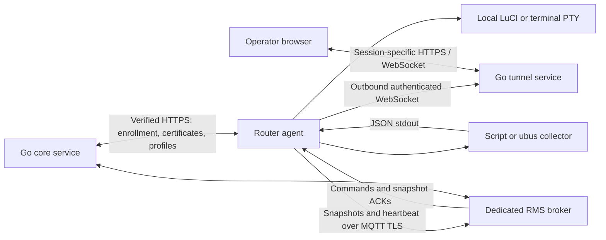

# How the XNET RMS router agent works

Applies to the current **2.0.0-1** implementation. This document describes the
code in this repository, including its current limits. Cross-compilation and
host tests have passed; operation on the XE33 2S has not yet been qualified.

## 1. What runs on the router

The agent is a C program installed as `/usr/sbin/niseva-agent`. OpenWrt's `procd`
service manager starts and supervises it through `/etc/init.d/niseva-agent`.
The installed configuration disables it until installation trust and connection
settings have been provisioned.

The agent performs four jobs:

1. Establishes and maintains the router's certificate identity.
2. Downloads assigned monitoring profiles and actively collects their JSON.
3. Buffers snapshots and sends them to RMS until application acknowledgments arrive.
4. Opens one authorized LuCI or terminal session through the tunnel gateway.

It initiates outbound connections. RMS does not need a publicly reachable router
address or an inbound port forwarded to the router.



Customer permissions, historical storage, chart definitions, and session
authorization belong to the backend. The router executes the assigned collection
instructions and transports the results.

## 2. Startup and process structure

At startup, the main process initializes its event loop, cryptographic randomness,
MQTT library, and empty telemetry queue. It reads board metadata from
`/var/xnet_board_info.json`, with fallbacks to local system files for MAC address,
model, architecture, and firmware information.

An explicitly configured `serial_number` overrides the detected serial. When
board metadata has no serial, the code can use the complete MAC address prefixed
with `MAC-`. It no longer supplies a shared demo serial. Startup fails if it
cannot obtain a serial or required connection settings.

The agent generates a random `boot_id` on **each agent process start**. Despite
its name, this identifies an agent run; restarting the service changes it even
without rebooting Linux.

| Execution context | Work performed |
|---|---|
| Main process | MQTT callbacks, heartbeat, telemetry queue, collection scheduling and child supervision |
| Enrollment/profile worker | HTTPS certificate operations or profile and bundle downloads; one such worker at a time |
| Scheduled collector child | One script or `ubus call` at a time |
| Tunnel worker | One remote session, TLS/WebSocket traffic, local HTTP proxy or terminal handling |
| Terminal shell child | Root shell attached to a pseudo-terminal, only during a terminal session |

The main loop ticks approximately every 50 ms. Queue operations and MQTT callbacks
run on this same loop. Slow HTTPS work and collector execution run in children.
A script's activation check can run in the profile worker while a scheduled
collector is active, so “one scheduled collector” does not mean only one script
process can ever exist.

The enrollment worker has a 60-second supervisory deadline; the profile worker
has a 600-second deadline. Individual HTTPS requests have a 5-second connection
timeout and a 15-second total timeout. Scheduling uses monotonic time; certificate
validity and observation timestamps use the router's wall clock.

## 3. Enrollment and certificate lifecycle

### First enrollment

The installer supplies the installation CA certificate, collector verification
key, HTTPS endpoint, broker address, and customer enrollment token. A correct
local clock is required before TLS and certificate validation can succeed.

The first enrollment follows this sequence:

1. Generate an EC P-256 private key locally at `/etc/xnet-rms/client.key`.
2. Create and sign a certificate signing request (CSR).
3. POST the CSR, serial, model, firmware version, and enrollment token to
   `/api/v1/provision/check-in` over verified HTTPS.
4. The core associates the router with the token's customer and returns an
   immutable `device_id`, client certificate, and broker connection details.
5. Validate the certificate's issuing CA, client-authentication purpose, device
   identity, validity, and match with the local private key.
6. Write the certificate atomically and save the returned identity and broker
   settings in UCI. Reload configuration and connect to MQTT using the certificate.

The private key is not uploaded. Existing key material is reused; a damaged key
is not silently replaced. If an already identified router loses its private key,
automatic recovery cannot prove that identity and requires operator intervention.

### Renewal and recovery

The backend issues one-year device certificates. The agent considers renewal due
when 90 days or less remain and normally checks certificate state hourly. Failed
certificate work is retried after approximately 60 seconds; initial work is
staggered by a random delay of up to 14 seconds.

| Certificate state | Agent action |
|---|---|
| Valid, more than 90 days left | Continue normal operation |
| Valid, within renewal window | Call `/api/v1/provision/renew` using the client certificate |
| Missing, unreadable, expired, or not yet valid | Attempt the challenge recovery path for a known device ID |
| Known device ID but missing/unusable private key | Fail recovery; do not replace the identity |

Recovery first requests `/api/v1/provision/challenge`. The agent checks that the
challenge message is bound to its device ID, signs it using its existing key,
and submits the proof to `/api/v1/provision/recover`. These calls still verify the
HTTPS server, but do not present an expired client certificate. The backend must
validate device authorization, revocation status, challenge freshness, and proof,
and prevent challenge reuse.

Recovery does not bypass a bad clock or missing CA trust: HTTPS verification must
still succeed. The enrollment token is currently retained in UCI after enrollment;
the code does not automatically erase it.

## 4. Monitoring profiles and collector execution

The agent retrieves assigned profiles from `/api/v1/agent/profiles` using its
client certificate. It refreshes them approximately every five minutes and stores
the accepted profile list at `/tmp/xnet-rms-profiles.json`.

A profile specifies the source, version, collection interval, timeout, output
limit, and either:

- **ubus:** execute `/bin/ubus call <object> <method> <JSON arguments>`.
- **script:** execute a particular version of a verified collector bundle.

The agent collects the complete bounded JSON output. Declared field extraction,
labels, units, status mappings, filtering, and historical aggregation are backend
responsibilities; the agent does not build charts or average measurements.

| Collection limit | Current value |
|---|---|
| Assigned profiles accepted by agent | Up to 16 |
| Interval per profile | 60–300 seconds |
| Execution timeout per profile | 1–15 seconds |
| Output limit per profile | 256–32,768 bytes |
| Initial delay after loading profiles | Random 0–29 seconds per profile |
| Accepted collector output | One JSON object or array on stdout |

The parent reads stdout without blocking its event loop. A timed-out or oversized
collector is killed as a process group. The agent also cleans up the group when
the direct child exits. Collector stdin and stderr are directed to `/dev/null`.
Scripts should therefore emit their structured results on stdout and avoid
interactive prompts or extra diagnostic text there.

Exit code `0` with valid JSON produces `status: "ok"`. Exit code `2` is used for
`unsupported`; other failures produce `error`. Current failure snapshots contain
an empty data object and a generic error message: the original failing script's
JSON diagnostics and stderr are not preserved.

Collectors run with the agent's privileges, normally root. A child process and
output/time limits are **not an operating-system security sandbox** or a CPU/RAM
quota. Only trusted, reviewed collectors should be approved.

### Signed collector bundles

For a newly required bundle version, the agent downloads:

`GET /api/v1/agent/bundles/<bundle_id>?version=<version>`

It checks the requested identity/version, SHA-256 of the script, and its signature
using `/etc/xnet-rms/collector.pub`. It then writes the script atomically, performs
a bounded activation execution, and updates `current`/`previous` links. Accepted
profile configuration is written only after the synchronization succeeds.

Scripts are stored as `/etc/xnet-rms/collectors/<bundle_id>/<version>.sh`. The
`.sh` suffix is a storage convention; the script's shebang chooses its interpreter.
A Lua collector can therefore be stored under this filename.

Scheduled execution uses the exact version in the profile, not the `current`
symlink. Failed initial activation retains the previously accepted profile list.
There is no automatic runtime rollback after later collection failures, and no
old-version garbage collection yet. Already present version files are reused
without signature re-verification on every synchronization.

## 5. Snapshot delivery and acknowledgments

Each collection produces an envelope like this illustrative example:

```json
{
  "schema_version": 1,
  "device_id": "11111111111111111111111111111111",
  "source_id": "system",
  "profile_id": "22222222222222222222222222222222",
  "profile_version": 1,
  "boot_id": "33333333333333333333333333333333",
  "sequence": 1,
  "observed_at": "2026-09-07T06:00:00Z",
  "status": "ok",
  "error": "",
  "dropped": 0,
  "data": {"uptime": 4200}
}
```

`observed_at` records when the collection started. Sequence numbers increase
across all sources during the current agent run. The `dropped` counter reports
queue-overflow discards accumulated during that run.

All topics are scoped to the immutable device identity:

| Topic suffix under `rms/v1/devices/<device_id>/` | Direction | Purpose |
|---|---|---|
| `snapshots` | Router → core through broker | JSON snapshots, MQTT QoS 1 |
| `acks` | Core → router through broker | Application-level snapshot acceptance |
| `heartbeat` | Router → core through broker | Connectivity, normally QoS 0 |
| `commands` | Core → router through broker | Authorized remote-session requests |

The broker must enforce certificate-based topic permissions. Checking topic names
inside the agent alone cannot establish who is authorized to publish commands.

### The 2 MiB backlog

Snapshots enter a FIFO linked queue in RAM. Queue accounting includes each node,
topic, and serialized payload. The queue rejects payloads larger than 64 KiB and
drops the oldest queued snapshots when space is required. The 2 MiB limit is for
this accounted backlog—not total process memory, allocator overhead, TLS buffers,
MQTT library buffers, or collector children.

The agent attempts to publish the oldest queued entry no more frequently than
approximately once every two seconds. It retains that entry until an application
ACK matches its **boot ID, source ID, and exact sequence number**. A broker's MQTT
PUBACK alone does not remove an entry.

The backend commits accepted data before publishing the application ACK. If an ACK
is lost, the agent sends the entry again and backend deduplication prevents a
second historical record. This requires the corresponding backend implementation;
it is not a property supplied by MQTT alone.

An entry the backend permanently rejects can hold up later entries until it is
removed by queue overflow. A negative-acknowledgment/quarantine path is not yet
implemented.

The backlog, sequence counter, and discard counter are lost on agent restart or
router reboot. The profile cache is in `/tmp`: it can survive an agent restart
within the same boot, but is normally lost on router reboot. Without a successful
profile fetch after reboot, the router can send heartbeats but has no profiles to
collect. Telemetry is not persisted to flash.

## 6. Heartbeat and connectivity

The agent sends `{"status":"online"}` on MQTT connection and every 60 seconds.
It configures an MQTT last will containing `{"status":"offline"}` with a
30-second keepalive. It attempts reconnects with jitter after connection errors.

The backend also uses a 180-second heartbeat timeout; offline detection does not
rely solely on the broker's last will. Heartbeats are separate from the telemetry
queue, so an unacknowledged snapshot does not intentionally block them.

Connectivity and source health are separate. A router can be online while its
collector is failing, unsupported, waiting behind another collector, or stale.
The dashboard determines freshness from snapshot observation time and profile
interval.

## 7. Remote LuCI and terminal sessions

A user requests remote access through RMS. The core checks the user's role,
customer ownership, router availability, and session limits before publishing an
`open_session` command. The agent accepts only its device-specific command topic
and the supported protocols `HTTP_LUCI` and `TERMINAL_SSH`.

The command supplies a session ID, HTTPS gateway URL, and expiry. The agent rejects
invalid IDs, unsupported protocols, expired requests, lifetimes over 900 seconds,
and a new request while another tunnel worker is running. It does not terminate
the current operator to make room.

The worker initiates a TLS-authenticated WebSocket connection to
`/router/<session_id>` on the tunnel service. The gateway must bind that session to
the intended router certificate. Browser authorization and customer isolation are
performed by the core and tunnel service, not by a local user database on the
router.

### LuCI

The worker creates a temporary rpcd session through local ubus, sets its user to
`root`, supplies a session token, and grants the required scopes. It injects the
resulting authentication cookies when proxying requests to `http://127.0.0.1`.
RMS therefore does not need to store a router root password.

HTTP requests and responses travel as JSON WebSocket messages with base64 bodies.
The current local proxy has a 10-second request timeout and a 1 MiB response-body
limit. It forwards selected headers and does not follow local HTTP redirects
itself. The gateway isolates browser sessions using session-specific hostnames.

This path assumes the router's LuCI service is available on local HTTP port 80 and
its rpcd/session interfaces match the implementation. Single sign-on still needs
verification against the actual XNET firmware.

### Terminal

The worker creates a pseudo-terminal and starts `/bin/ash`, falling back to
`/bin/sh`, as root. The current terminal size is fixed at 100 columns × 30 rows.
Browser input and PTY output travel over the authenticated session.

`TERMINAL_SSH` is the API protocol name; the implementation does **not** open an SSH
connection or run an SSH server. It uses a local PTY and shell. Terminal resize
messages and terminal recording are not implemented.

### Closing a session

The agent has a monotonic expiry timer and the worker also checks its lifetime.
On ordinary worker exit it closes sockets, destroys the temporary rpcd session,
and terminates/reaps the terminal shell process group. A parent-death signal helps
terminate a worker if the main agent exits unexpectedly. Rpcd timeout provides a
further expiry boundary for temporary LuCI authentication.

The agent currently has no separate `close_session` MQTT action. Explicit closure
or revocation is enforced through the gateway: it checks the core periodically
and closes the router connection. Abrupt power loss, forced termination, and all
cleanup paths still require target testing. Arbitrary commands deliberately
started by a root terminal user can create detached processes; this is not a
restricted command sandbox.

## 8. Files and configuration

| Router path | Purpose | Lifetime |
|---|---|---|
| `/etc/config/niseva` | Connection settings, enrollment token, device ID | Persistent UCI configuration |
| `/etc/xnet-rms/ca.crt` | Installation HTTPS/MQTT trust anchor | Provisioned persistently |
| `/etc/xnet-rms/collector.pub` | Collector signature verification key | Provisioned persistently |
| `/etc/xnet-rms/client.key` | Router-generated private identity key | Persistent; never upload |
| `/etc/xnet-rms/client.crt` | Current device certificate | Replaced on successful renewal/recovery |
| `/etc/xnet-rms/collectors/` | Downloaded versioned scripts | Persistent; no automatic pruning yet |
| `/tmp/xnet-rms-profiles.json` | Accepted profile cache | Volatile across reboot |
| `/usr/libexec/xnet-rms/ipsec.lua` | Packaged strongSwan collector source | Firmware/package file |
| `/lib/upgrade/keep.d/niseva-agent` | Keeps configuration and identity during supported sysupgrade backup flows | Package file |

| UCI option in section `general` | Meaning |
|---|---|
| `enabled` | Used by the init script; defaults to `0` |
| `server_url` | Verified HTTPS core base URL; no trailing slash is recommended |
| `mqtt_host` | Broker hostname; required at startup and updated by enrollment |
| `mqtt_port` | Normally 8883; enrollment currently requires/returns 8883 |
| `enrollment_token` | Customer token for first enrollment |
| `device_id` | Backend-issued identity; do not assign manually |
| `serial_number` | Optional explicit override for detected serial |

Legacy `heartbeat_interval`, `telemetry_interval`, `mqtt_token`, and `provisioned`
values are still read or stored by parts of the code, but do not control the new
paths as their names might imply. Heartbeat is fixed at 60 seconds, collection
intervals come from profiles, MQTT uses certificates, and provisioned state is
recomputed from device identity and certificate dates. Legacy rollback/FOTA
function declarations are not evidence of active features.

## 9. IPsec and additional customer telemetry

The supplied IPsec collector calls strongSwan `swanctl --list-conns` and
`--list-sas`. It reports configured CHILD_SAs, their IKE/child states, and available
traffic counters. A tunnel is UP only when its IKE SA is ESTABLISHED **and** its
CHILD_SA is INSTALLED. It does not infer establishment from a PID file.

This collector supports the parsed swanctl output format; it is not a universal
adapter for every IPsec implementation. It needs Lua, a supported JSON module,
and swanctl. Publishing the script as a signed bundle and assigning a profile is
required; merely shipping the file does not activate it.

For a new customer parameter, the team supplies an approved ubus query or script
that emits bounded JSON, then creates a profile with the relevant field mappings
and assigns it to the customer's devices. The agent picks it up on profile sync.
There is no release-1 HTTP listener or local socket accepting unsolicited JSON
from arbitrary services. A separate service can expose data for the scheduled
collector to read.

## 10. Source map and verification boundary

| Source | Responsibility |
|---|---|
| `agent/src/main.c` | Startup, configuration, event loop, MQTT connection, worker scheduling |
| `agent/src/bootstrap.c` | Board identity, private key, CSR, certificate validation, renewal/recovery |
| `agent/src/runtime.c` | Verified HTTPS, bounded child capture, atomic writes, random IDs |
| `agent/src/collectors.c` | Profile synchronization, signature checks, collector execution, envelopes |
| `agent/src/telemetry.c` | RAM backlog, ACK matching, paced publication, heartbeat |
| `agent/src/commands.c` | Device-topic and remote-session command validation |
| `agent/src/tunnel.c` | One-session supervision and expiry timer |
| `agent/src/tunnel_worker.c` | TLS/WebSocket transport, local HTTP proxy, rpcd sessions, PTY |
| `agent/files/ipsec.lua` | strongSwan output collection and parsing |
| `agent/tests/runtime_test.c` | Host queue, child timeout, output limit and HTTPS-only tests |
| `collectors/ipsec/test.lua` | IPsec parser fixtures |

The agent has been compiled for `mips_24kc`, and host tests cover queue limits,
exact ACKs, hung collectors, oversized output, and selected IPsec parsing cases.
See `agent/BUILD.md` for artifacts and build details.

These checks do not yet establish actual-router flash usage including dependencies,
peak RAM/CPU usage, live certificate recovery, bundle activation under power loss,
LuCI compatibility, terminal cleanup, or fleet capacity. The larger RMS deployment
and qualification work remains in progress.
