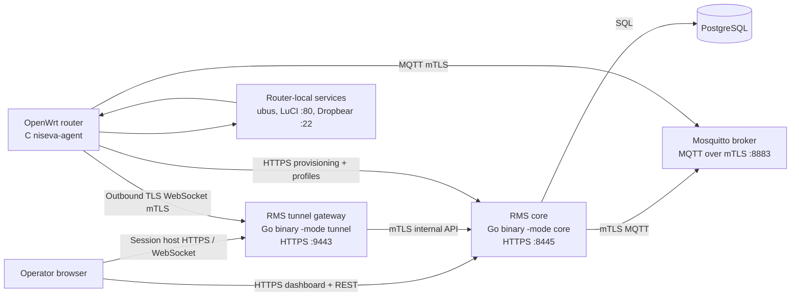
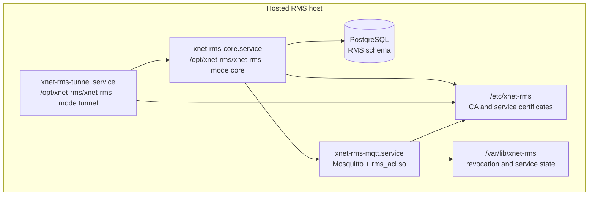
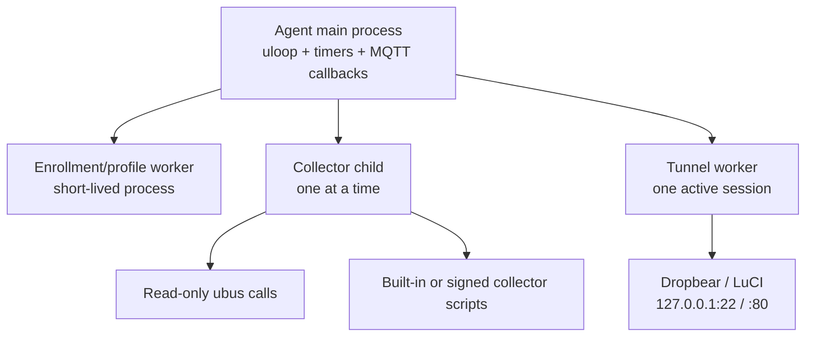
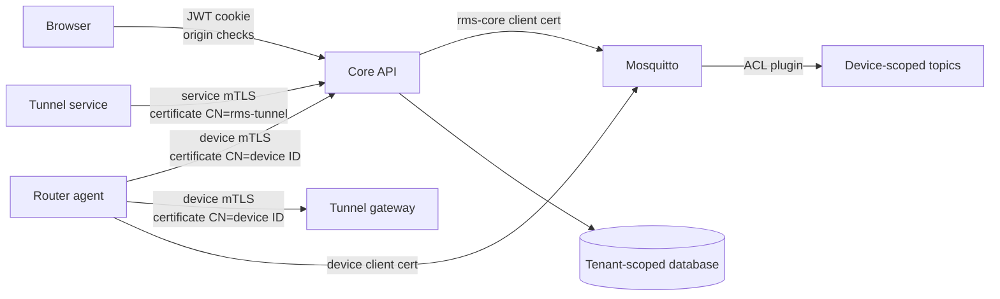
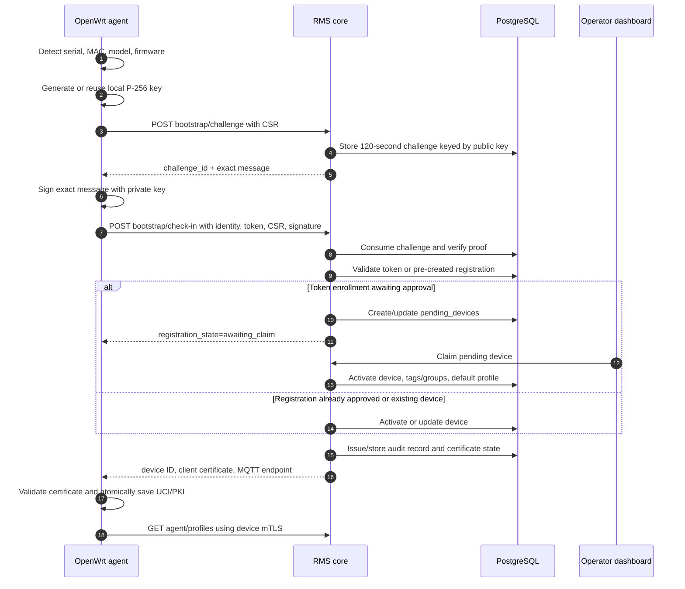
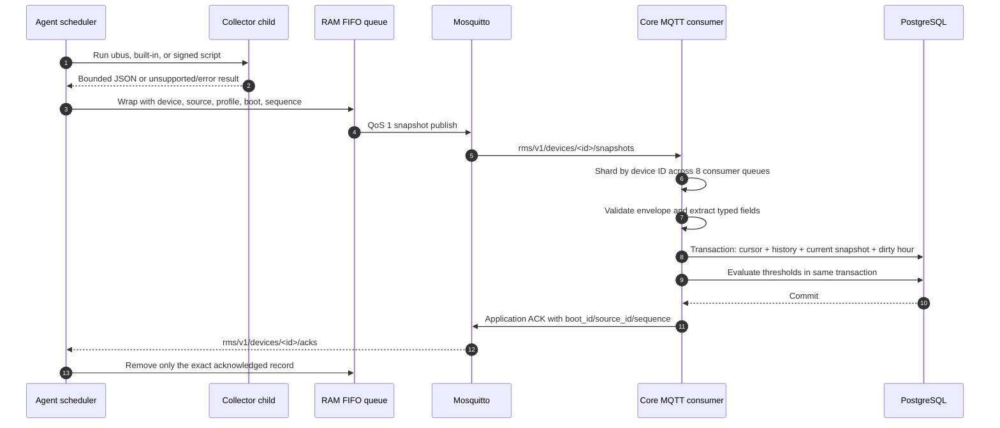
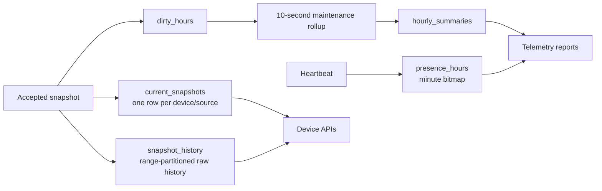
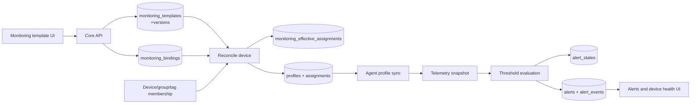
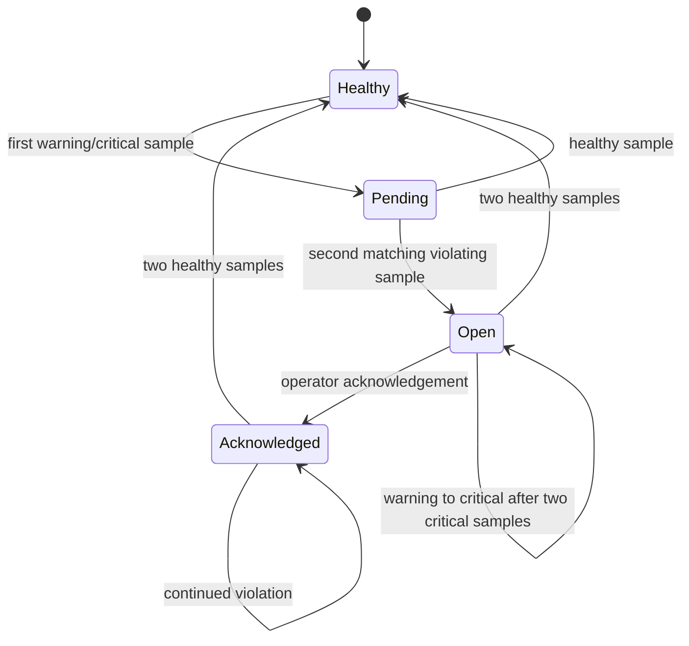

# XNET RMS architecture

**Status:** source-backed architecture overview
**Date:** 2026-09-11
**Scope:** the active implementation in `backend/internal/rms`, `frontend/src`,
`agent/src`, `broker`, `luci-app-niseva-rms`, and `deployment/v2`.

## 1. What the system does

XNET RMS is a remote management platform for OpenWrt routers. It gives an
operator a web dashboard for device inventory, onboarding, telemetry,
monitoring, alerts, reports, and short-lived remote sessions.

The most important design choice is the direction of the network connections:
routers make outbound connections to RMS. The router does not need an inbound
firewall rule or a port-forwarded service for RMS Connect to work.

At runtime the system is split into four trust domains:

| Domain | Main responsibility |
| --- | --- |
| Operator browser | Dashboard UI and authenticated remote-session viewer |
| RMS services | API, tenant/RBAC decisions, telemetry processing, and tunnel gateway |
| MQTT broker | Device command and telemetry transport |
| OpenWrt router | Local identity, collection, buffering, configuration, and outbound tunnel |

The database is the durable source of truth for RMS state. MQTT is a transport,
not a database: application acknowledgements are sent only after telemetry has
been accepted into the database transaction.

## 2. System context



### Connection types

| Connection | Direction | Why it exists | Authentication |
| --- | --- | --- | --- |
| Dashboard/API | Browser → core | Login, inventory, onboarding, monitoring, reports | HTTPS plus JWT cookie or bearer token |
| Provisioning | Router → core | Bootstrap, certificate renewal/recovery, profile and bundle download | Bootstrap challenge/CSR, then device mTLS |
| Device messaging | Router ↔ broker ↔ core | Heartbeats, snapshots, commands, previews, application ACKs | MQTT TLS 1.2 with client certificates |
| Tunnel attachment | Router → tunnel | Reverse WebSocket connection through NAT/CGNAT | Device mTLS and session ID checks |
| Tunnel control | Tunnel → core | Validate, claim, close, and reconcile sessions | Service mTLS; tunnel certificate CN is `rms-tunnel` |
| Router-local access | Agent → `127.0.0.1` | Collect data, proxy LuCI, or bridge SSH | Local process permissions and temporary SSH key overlay |

## 3. Process and deployment topology

The same Go executable is run in different modes. The current deployment keeps
the modes in separate systemd services so API/database work and long-lived
tunnel connections have independent process limits and restart policies.



The core serves the compiled dashboard from the embedded `dist/*` filesystem.
The production build path is therefore:

```text
frontend/src -> npm run build -> frontend/dist
             -> copy to backend/cmd/server/dist
             -> go build ./cmd/server
             -> embedded dashboard inside xnet-rms
```

A frontend build by itself does not update a running server. The embedded copy
and the server binary must both be rebuilt and deployed.

## 4. Component ownership

### 4.1 React dashboard

The active UI is a React 18 + TypeScript + Vite single-page application.
`frontend/src/App.tsx` owns the high-level application state and loads data from
the REST API through `frontend/src/api.ts`.

The URL is the navigation source of truth. Current routes cover:

- overview and fleet devices;
- device detail, groups, registrations, and pending claims;
- active remote sessions;
- telemetry reports and alerts;
- customer tags, users, enrollment tokens, organizations, profiles, bundles,
  and audit records.

The dashboard does not talk directly to PostgreSQL, Mosquitto, or the router.
It asks the core to perform every state-changing operation. Remote LuCI and
terminal views are opened using a short-lived launch URL returned by the core.

### 4.2 RMS core

The core is the control plane and durable data plane. The active implementation
uses Go's `net/http`, `database/sql` with pgx, Paho MQTT, JWT, bcrypt,
WebSocket, and SSH libraries.

Responsibilities in `backend/internal/rms`:

| Area | Implementation responsibility |
| --- | --- |
| HTTP API | Route registration, JSON validation, security headers, origin checks, and error responses |
| Authentication | Login, eight-hour HS256 JWT, secure HTTP-only cookie, and disabled-user checks |
| Authorization | Hierarchical roles: `VIEWER` → `OPERATOR` → `ORG_ADMIN` → `SUPER_ADMIN` |
| Tenant isolation | Organization scoping in handlers and SQL predicates; super-admin may select a customer scope |
| Onboarding | Registration records, pending devices, token use, claim/activation, tags, and groups |
| Device identity | Device certificate CN, public-key match, revocation checks, and device mTLS |
| Telemetry | Snapshot envelope validation, deduplication, current state, history, rollups, and ACKs |
| Monitoring | Catalog metrics, versioned templates, device/group/tag bindings, effective profiles, and previews |
| Alerts | Threshold evaluation, debounce, escalation, acknowledgement, resolution, and event history |
| Remote sessions | Session lifecycle, TTL, ownership, capacity, one-time tickets, and SSH key material |
| Maintenance | History rollups, session/challenge cleanup, stale evaluation, partitions, and retention |

### 4.3 Tunnel gateway

The tunnel service is a separate instance of the Go binary. It does not own the
session decision. It asks the core's internal mTLS API whether a session is
active, then maintains the live browser/router pair in memory.

Supported session protocol values in the current server are:

| Protocol | Current path |
| --- | --- |
| `SSH_LUCI` | Gateway creates SSH over the router WebSocket, then proxies HTTP to router LuCI at `127.0.0.1:80` |
| `TERMINAL_SSH` | Gateway creates an SSH PTY and connects it to the browser terminal WebSocket |
| `HTTP_LUCI` | Older framed HTTP-over-WebSocket path retained in the gateway and agent |

The active dashboard launches `SSH_LUCI` and `TERMINAL_SSH`. SFTP, LAN-device
forwarding, and high-port desktop forwarding are not current routes in the
active implementation and should be treated as roadmap or historical material
where they appear in older documents.

### 4.4 OpenWrt agent

`niseva-agent` is a native C daemon designed for OpenWrt. It is started by
`procd` through `/etc/init.d/niseva-agent` and uses a single `uloop` event loop.

The main process owns scheduling and connection state. Slow work is isolated:



The agent owns:

- board identity detection and the persistent P-256 private key;
- HTTPS bootstrap, certificate renewal, and certificate recovery;
- MQTT mTLS connection, heartbeat, command handling, and telemetry queue;
- profile synchronization and signed collector bundle activation;
- bounded collector execution and snapshot envelopes;
- an in-memory 2 MiB FIFO telemetry queue with application ACK removal;
- temporary SSH authorization for remote sessions;
- tunnel TTL and cleanup;
- UCI configuration and the 180-second configuration rollback watchdog.

Important router-local paths are:

| Path | Purpose |
| --- | --- |
| `/etc/config/niseva` | UCI configuration and provisioned server binding |
| `/etc/xnet-rms/client.key` | Persistent device private key |
| `/etc/xnet-rms/client.crt` | Device client certificate |
| `/etc/xnet-rms/ca.crt` | RMS trust anchor |
| `/etc/xnet-rms/collector.pub` | Collector bundle verification key |
| `/tmp/xnet-rms-profiles.json` | Atomically replaced active profile document |
| `/var/run/niseva-rms.sock` | Local datagram control socket |
| `/var/run/niseva-rms-status.json` | Mode, registration, identity, and connection status |
| `/tmp/rms-ssh` | Temporary authorized-key overlay during SSH sessions |

### 4.5 Local LuCI application

`luci-app-niseva-rms` is a router-local LuCI package. It is not the cloud
dashboard. It exposes RMS settings, status, and a “Connect now” action by
calling `/usr/sbin/niseva-agent --status` or `--connect`.

## 5. Trust and security boundaries



### Browser authentication

1. The browser posts credentials to `POST /api/v1/auth/login`.
2. The core verifies the bcrypt password hash and issues an HS256 JWT.
3. The JWT is returned and also stored as the `rms_auth` secure, HTTP-only,
   SameSite-Strict cookie under `/api/v1`.
4. Protected handlers reload the user from PostgreSQL, so a disabled user loses
   access even if the token has not expired.

### Device authentication

After bootstrap, device endpoints require a verified client certificate. The
core checks the certificate's common name, revocation marker, and public-key
match against the `devices` row. The MQTT ACL plugin derives the username from
the verified certificate rather than trusting the MQTT client ID.

For a device identity, the broker permits only that device's topic namespace:

```text
rms/v1/devices/<device-id>/snapshots   device write
rms/v1/devices/<device-id>/heartbeat   device write
rms/v1/devices/<device-id>/commands    device read/subscribe
rms/v1/devices/<device-id>/acks        device read/subscribe
```

The core uses the broker's broader `rms-core` identity to receive device data
and publish commands or application ACKs.

### Session authentication

A remote session has two separate authorizations:

- the core authorizes the operator and creates the session record;
- the tunnel authorizes the browser using a one-time ticket exchanged for a
  host-only `__Host-rms_session` cookie.

The RMS session authorizes access to the tunnel only. For `SSH_LUCI`, the
operator still signs in to LuCI with the router's own credentials; the RMS
gateway does not generate or inject a LuCI `sysauth` cookie.

## 6. Flow: router enrollment



The enrollment token is a bootstrap credential. The agent clears it after
successful provisioning; normal operation uses the device certificate.

Certificate maintenance has two paths:

- renewal uses the current device mTLS identity when the certificate has 90
  days or less remaining;
- recovery uses a short-lived challenge signed by the persistent local private
  key when the certificate is missing, invalid, expired, or not yet valid.

## 7. Flow: telemetry acquisition and delivery



### Collector contract

Profiles can select:

- an allowlisted read-only ubus method;
- a built-in collector such as `device_overview`, `ipsec`, or
  `modbus_health`;
- a signed script bundle fetched from the core.

The agent runs at most one scheduled collector child at a time. Each child has
a timeout and output limit. A complete JSON result maps to `ok`; exit code 2
maps to `unsupported`; malformed JSON, non-zero failure, timeout, and output
overflow map to `error`.

The queue is deliberately bounded and in memory. It drops the oldest records
when it reaches 2 MiB, reports the cumulative dropped count in later envelopes,
and loses queued records on agent restart. MQTT PUBACK is not the same as the
application ACK from RMS.

### Storage model



`snapshot_cursors` prevents an older or duplicate sequence from replacing a
newer observation for the same device/source/boot. Current snapshots power
the fleet and device views. Raw history supports detailed inspection, while
hourly summaries support bounded reports over longer windows.

## 8. Flow: monitoring, effective profiles, and alerts

Customer-facing monitoring is declarative. A customer selects typed metrics
from the server-owned catalog and binds a versioned template to a device,
group, or tag.



The reconciliation step compiles the customer abstraction into the existing
agent profile contract. This keeps the agent unaware of customer groups and
tags. The same device can receive one effective profile per active source, with
a limit of 16 active monitoring sources per device.

Alert state is debounced in PostgreSQL:



Stale rules are evaluated by the maintenance loop once per minute. Template
changes, archive operations, unbinding, device/tag/group changes, and device
revocation resolve alerts that no longer have a valid assignment, with an
explicit resolution reason and event history.

## 9. Flow: remote LuCI and terminal sessions

```mermaid
sequenceDiagram
    autonumber
    actor Operator
    participant UI as Dashboard
    participant Core as RMS core
    participant MQTT as Mosquitto
    participant Agent as Router agent
    participant Gateway as Tunnel gateway
    participant Router as LuCI / Dropbear

    Operator->>UI: Select device and remote protocol
    UI->>Core: POST /api/v1/sessions
    Core->>Core: Check role, tenant, online state, one-session/device, capacity
    Core->>Core: Store 15-minute session and one-time ticket
    Core->>MQTT: open_session command
    Core-->>UI: launch_url and expiry
    MQTT->>Agent: Device command
    Agent->>Agent: Install temporary SSH key overlay when needed
    Agent->>Gateway: Outbound mTLS WebSocket /router/<session-id>
    Gateway->>Core: Internal mTLS session lookup
    Gateway-->>Agent: WebSocket pair established
    Operator->>Gateway: Open launch_url with ticket
    Gateway->>Core: Consume ticket; store browser cookie hash
    Gateway-->>Operator: Redirect to session root
    alt SSH_LUCI
        Operator->>Gateway: Browser LuCI request
        Gateway->>Agent: SSH transport over WebSocket
        Agent->>Router: 127.0.0.1:22
        Gateway->>Router: HTTP via SSH to 127.0.0.1:80
        Router-->>Operator: LuCI login and pages
    else TERMINAL_SSH
        Operator->>Gateway: Browser terminal WebSocket
        Gateway->>Agent: SSH PTY over WebSocket
        Agent->>Router: Dropbear 127.0.0.1:22
        Router-->>Operator: Interactive shell bytes
    end
    Operator->>Core: Close or extend session
    Core->>MQTT: close_session or extend_session
    Agent->>Agent: Stop worker, unmount key overlay, close sockets
    Gateway->>Core: Mark session closed
```

Session invariants are enforced at multiple layers:

- initial lifetime is 15 minutes;
- extensions add 15 minutes but cannot exceed one hour from creation;
- no more than 25 active sessions are accepted;
- the database has a partial unique index allowing one active session per
  device;
- the agent runs one tunnel session at a time;
- the gateway checks session state periodically and closes pairs when the core
  says the session is inactive.

## 10. Core API surface by workflow

The core registers the following families of routes in
`backend/internal/rms/core.go`:

| Workflow | Representative routes |
| --- | --- |
| Authentication | `/api/v1/auth/login`, `/api/v1/auth/me`, `/api/v1/auth/logout` |
| Bootstrap | `/api/v1/provision/bootstrap/challenge`, `/api/v1/provision/bootstrap/check-in` |
| Certificate lifecycle | `/api/v1/provision/renew`, `/api/v1/provision/challenge`, `/api/v1/provision/recover` |
| Device onboarding | `/api/v1/registrations`, `/api/v1/pending-devices`, `/api/v1/pending-devices/{id}/claim` |
| Fleet telemetry | `/api/v1/dashboard`, `/api/v1/devices`, `/api/v1/devices/{id}/snapshots`, `/api/v1/devices/{id}/history` |
| Monitoring | `/api/v1/monitoring/catalog`, `/api/v1/monitoring/templates`, `/api/v1/monitoring/bindings`, `/api/v1/monitoring/previews` |
| Alerts/reports | `/api/v1/alerts`, `/api/v1/reports/telemetry` |
| Remote sessions | `/api/v1/sessions`, `/api/v1/sessions/{id}/extend`, `/api/v1/sessions/{id}` |
| Agent delivery | `/api/v1/agent/profiles`, `/api/v1/agent/bundles/{id}` |
| Tunnel control | `/internal/sessions/{id}`, `/internal/sessions/{id}/claim`, `/internal/sessions/{id}/close`, `/internal/reconcile` |

All JSON request bodies are size-limited and reject unknown fields. Mutating
requests check the browser origin when an origin header is present. Protected
handlers apply role checks before executing tenant-scoped queries.

## 11. Database architecture

PostgreSQL migrations are embedded in the Go binary and applied explicitly by
`-mode migrate`. The core refuses to serve unless migration version 9 is
present.

The main table groups are:

| Group | Tables |
| --- | --- |
| Tenancy and identity | `organizations`, `users`, `devices`, `audit_logs` |
| Enrollment | `enrollment_tokens`, `registrations`, `pending_devices`, `bootstrap_challenges`, `recovery_challenges` |
| Fleet organization | `tags`, `device_tags`, `device_groups`, `device_group_members`, `enrollment_token_groups` |
| Collection | `profiles`, `assignments`, `collector_bundles` |
| Telemetry | `snapshot_cursors`, `current_snapshots`, `snapshot_history_*`, `hourly_summaries`, `dirty_hours`, `rollup_progress`, `presence_hours` |
| Monitoring | `monitoring_templates`, `monitoring_template_versions`, `monitoring_bindings`, `monitoring_effective_assignments` |
| Alerting | `alert_states`, `alerts`, `alert_events` |
| Remote access | `sessions` |

Tenant ownership is represented in the schema with foreign keys, indexes,
unique constraints, and trigger checks for tag/group membership. The handlers
also include organization predicates; both layers are needed because not every
database operation can be reduced to a single foreign key.

Retention is configuration-driven:

- raw history is held in range partitions and dropped after `RMS_RAW_DAYS`;
- hourly summaries, presence, and resolved alert events are deleted after
  `RMS_SUMMARY_DAYS`;
- expiration waits until dirty-hour rollups are complete.

### Fresh-install data contract

The default installation is intentionally empty of customer and demo data.
Migrations create the PostgreSQL schema and migration records only. The
installer then creates exactly one organization-owned `ORG_ADMIN` account;
it does not create a `SUPER_ADMIN`, sample routers, enrollment tokens, groups,
tags, telemetry, alerts, audit records, collector bundles, or monitoring
templates.

The organization row is required because an `ORG_ADMIN` must be tenant-scoped.
The built-in device-overview profile is created lazily in the first router
enrollment transaction, so a newly installed database remains empty until a
router is actually onboarded. Re-running the bootstrap command against a
database containing application data is rejected.

## 12. Operational lifecycle

```mermaid
flowchart LR
    Build[Build frontend] --> Sync[Sync frontend/dist to embedded dist]
    Sync --> Test[Go tests + frontend build]
    Test --> Commit[Commit intended source and generated assets]
    Commit --> Push[Push dev]
    Push --> Pull[Pull exact commit on VPS]
    Pull --> VBuild[Build server and record SHA-256]
    VBuild --> Install[Operator installs binary]
    Install --> Migrate[Run migrate only for new migrations]
    Migrate --> Restart[Restart core and tunnel]
    Restart --> Verify[Health, logs, browser, workflow checks]
    Verify --> Rollback[Restore prior binary if needed]
```



The current hosted layout is documented in `docs/LIVE_DEPLOYMENT.md` and
`deployment/v2/README.md`. In particular:

- Mosquitto is a separate service and is restarted only for broker, ACL, or
  certificate changes;
- the final privileged install and service restart normally require the VPS
  operator's sudo password;
- the hosted VPS is a deployment target, not the source-of-truth checkout;
- router IPK artifacts stay in the router workflow and are not uploaded to the
  RMS VPS.

## 13. Architecture strengths

1. **Outbound-only router connectivity.** The router can operate behind NAT or
   CGNAT while the gateway still provides controlled remote access.
2. **Layered device identity.** Bootstrap proof, device certificates, database
   public-key matching, MQTT ACLs, and tunnel certificate checks reinforce one
   another.
3. **Explicit tenant boundaries.** Role checks, organization predicates,
   ownership constraints, and audit records are part of normal handlers.
4. **Stable agent contract.** Customer-facing monitoring templates compile into
   the existing profile/snapshot protocol rather than adding customer concepts
   to the router daemon.
5. **Bounded resource usage.** Collector output, child lifetime, queue size,
   request bodies, session count, and database connection pools have explicit
   limits.
6. **Clear session expiry.** The core, gateway, MQTT command, and router worker
   each participate in cleanup instead of relying on a browser tab closing
   cleanly.

## 14. Known boundaries and review notes

These are not claims that the architecture is production-qualified; they are
important facts for anyone extending it.

- **Generated UI is part of the server release.** A changed React source tree
  does not change the hosted page until the embedded `dist` copy and Go binary
  are rebuilt.
- **Telemetry buffering is not durable.** The agent queue, sequence counter,
  and preview jobs are in RAM and are lost on process restart. The dropped
  count is visible, but lost records cannot be reconstructed by RMS.
- **Collector scripts are privileged.** The agent validates signatures, size,
  output, and runtime, but the current source does not provide an OS sandbox or
  independent CPU/RAM quota for collector children.
- **Preview transport needs verification.** The agent publishes preview data
  on `rms/v1/devices/<id>/previews`, while `broker/rms_acl.c` currently grants
  device writes only for `snapshots` and `heartbeat`. The monitoring preview
  flow should be tested or the ACL contract reconciled before relying on it.
- **Capacity is bounded and hard-coded in the current release.** The core and
  gateway cap active sessions at 25, and the database allows one active session
  per device.
- **Historical documents are broader than the active code.** Older notes may
  mention FOTA, SFTP, LAN forwarding, multiple product lines, demo accounts,
  Ant Design, or legacy package paths. Confirm behavior against the active
  source files listed below.
- **Live behavior still requires qualification.** Host tests and a successful
  build do not prove router installation, certificate lifecycle, MQTT outage
  replay, LuCI compatibility, terminal PTY behavior, firewall reachability, or
  production capacity.

## 15. Source-of-truth map

| Concern | Start here |
| --- | --- |
| Go server modes and embedded UI | [`backend/cmd/server/main.go`](../backend/cmd/server/main.go) |
| API routes, auth, RBAC, tenant scope | [`backend/internal/rms/core.go`](../backend/internal/rms/core.go) |
| Enrollment and pending-device activation | [`backend/internal/rms/enrollment.go`](../backend/internal/rms/enrollment.go), [`backend/internal/rms/onboarding.go`](../backend/internal/rms/onboarding.go) |
| Telemetry contract and ingestion | [`backend/internal/rms/telemetry.go`](../backend/internal/rms/telemetry.go), [`backend/internal/rms/broker.go`](../backend/internal/rms/broker.go) |
| Monitoring compilation and previews | [`backend/internal/rms/monitoring.go`](../backend/internal/rms/monitoring.go) |
| Alert state machine | [`backend/internal/rms/alerts.go`](../backend/internal/rms/alerts.go) |
| Reports and rollups | [`backend/internal/rms/reports.go`](../backend/internal/rms/reports.go), [`backend/internal/rms/maintenance.go`](../backend/internal/rms/maintenance.go) |
| Remote sessions and gateway | [`backend/internal/rms/sessions.go`](../backend/internal/rms/sessions.go), [`backend/internal/rms/gateway.go`](../backend/internal/rms/gateway.go) |
| TLS and installation PKI | [`backend/internal/rms/pki.go`](../backend/internal/rms/pki.go) |
| Database schema | [`backend/internal/rms/migrations`](../backend/internal/rms/migrations) |
| Dashboard state and routes | [`frontend/src/App.tsx`](../frontend/src/App.tsx), [`frontend/src/api.ts`](../frontend/src/api.ts), [`frontend/src/lib/routes.ts`](../frontend/src/lib/routes.ts) |
| Router lifecycle and local files | [`agent/HOW_IT_WORKS.md`](../agent/HOW_IT_WORKS.md), [`agent/src/main.c`](../agent/src/main.c) |
| Router collectors and profiles | [`agent/src/collectors.c`](../agent/src/collectors.c), [`agent/src/telemetry.c`](../agent/src/telemetry.c) |
| Router MQTT commands | [`agent/src/commands.c`](../agent/src/commands.c) |
| Router reverse tunnel | [`agent/src/tunnel.c`](../agent/src/tunnel.c), [`agent/src/tunnel_worker.c`](../agent/src/tunnel_worker.c) |
| Broker topic enforcement | [`broker/rms_acl.c`](../broker/rms_acl.c) |
| Router-local LuCI page | [`luci-app-niseva-rms/root/usr/lib/lua/luci/controller/niseva_rms.lua`](../luci-app-niseva-rms/root/usr/lib/lua/luci/controller/niseva_rms.lua) |
| Hosted deployment | [`docs/LIVE_DEPLOYMENT.md`](LIVE_DEPLOYMENT.md), [`deployment/v2/README.md`](../deployment/v2/README.md) |
